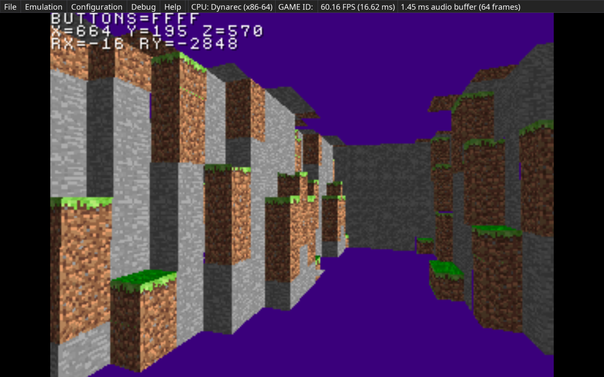
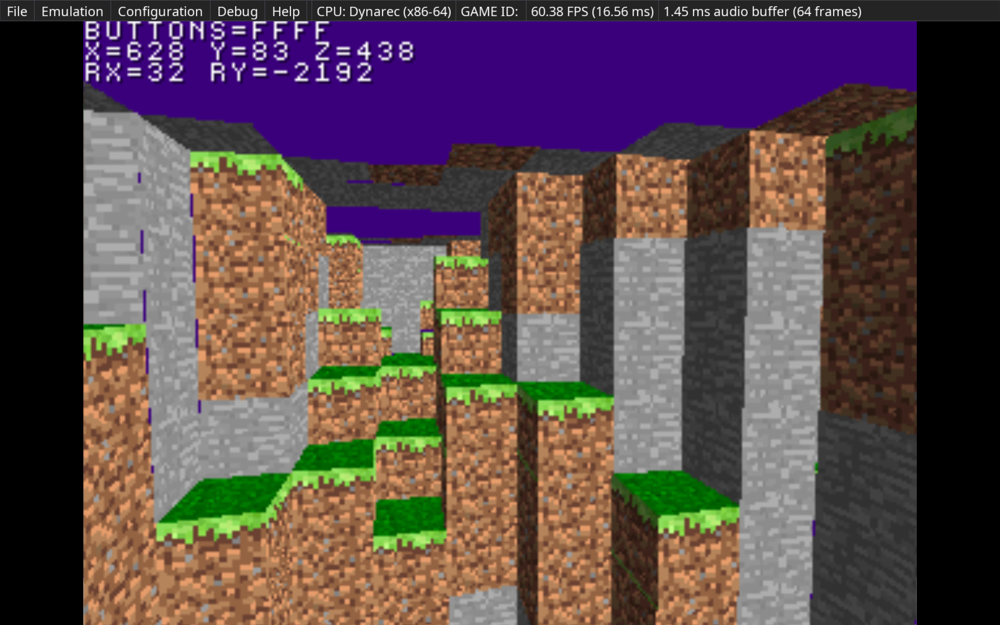
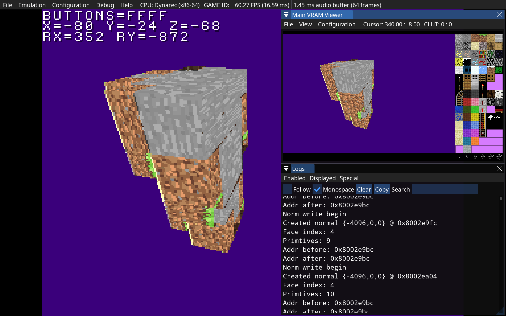

# PSX-Minecraft

Remake of Minecraft for PS1 with PSn00bSDK

**Table of Contents**
<!-- TOC -->
* [PSX-Minecraft](#psx-minecraft)
  * [Dependencies](#dependencies)
  * [References](#references)
  * [Building](#building)
  * [Docker Environment](#docker-environment)
    * [CLion](#clion)
  * [Progress](#progress)
<!-- TOC -->

## Dependencies

* Emulator: [PCSX Redux](https://github.com/grumpycoders/pcsx-redux)
* PS1 Library: [PSn00bSDK](https://github.com/Lameguy64/PSn00bSDK)

## References

* [Inline Programming Reference](./docs/Inline%20Programming%20Reference.pdf)
* [LibPSn00b Reference](./docs/LibPSn00b%20Reference.pdf)
* [Playstation Specifications psx-spx](https://psx-spx.consoledev.net/kernelbios/)
  (Everything from hardware to software in great detail)

## Building

Configuring the project can be done with

```shell
cmake --preset default .
```

Then the CD image can be built with

```shell
cmake --build ./build
```

This will create several files in the `build` directory. Using the
PCSX Redux emulator, you can load the `build/PSXMC.bin` CD image
and run it.

## Docker Environment

Depending on the system you are building on (Windows/Linux/OSX) you may want to build locally,
however, in the case that you are on OSX and want the ease of a development environment in
Linux without the extra configuration headache, a Dockerfile has been provided that can be
used with the `build_container.sh` script to build the project.

First build the docker image, which will initialise a Linux distribution with all the necessary
tooling and build the SDK. The following are optional arguments you can provide:

* `--build-arg="REPO_TARGET=<user name>/<repo name>"` specify the namespaced repo (potential a fork) to build from. Defaults
  to `Lameguy64/PSn00bSDK`
* `--build-arg="REPO_COMMIT_ISH=<branch/commit/tag>"` specify a build arg to target a specific branch/commit/tag of the SDK repo.
  Defaults to `master`
* `--build-arg="GCC_MIPSEL_ELF_TAG=<Lameguy64/PSn00bSDK release tag>"` specify a release tag to pull the GCC build from.
  Defaults to `v0.24`
* `--build-arg="CACHEBUST=$(date +%s)"` force a rebuild of the repo. Defaults to `0`.

Using this, we can build as follows:

```shell
docker build -t psxmc:latest -f Dockerfile .
```

With this, use the utility script `build_container.sh [<image:tag>]` to bundle assets and compile the
project. For example

```shell
./build_container.sh psxmc:latest
```

### CLion

You can use the Dockerfile to double as a build environment for CLion so that you can run
CMake within the Docker context attached to CLion. To the following to set this up:

1. Open up settings and go to `Build, Execution, Deployment > Toolchains`
2. Create a new Docker toolchain and select the image you had build before
3. Open the container settings
4. Set the CMake option to `Docker CMake`
5. Go to `Build, Execution, Deployment > CMake`
6. Create a new profile
7. Set the toolchain to the Docker toolchain you just created
8. Add `--preset default` to the CMake options field
9. Exit settings
10. Verify that the Docker daemon is running on your local
11. Reload CMake project

## Progress

Work so far, current progress being made on world chunk loading/unloading

|                                            |                                            |
|--------------------------------------------|--------------------------------------------|
|  |  |



