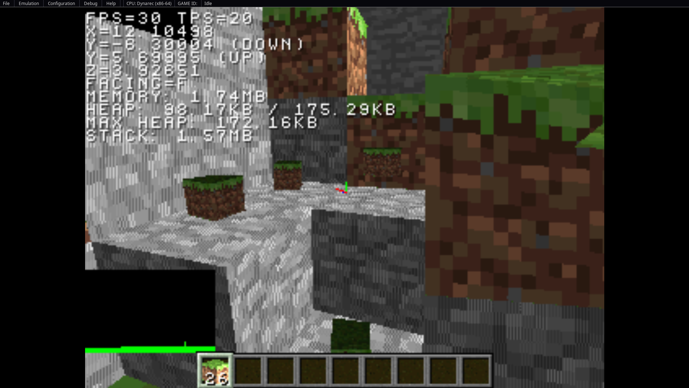
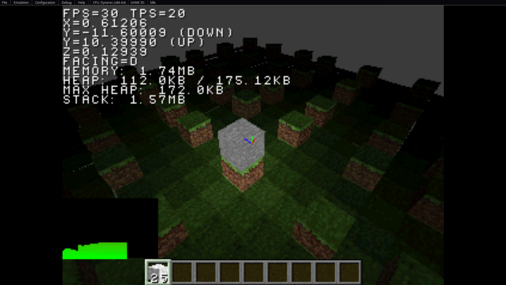

# PSX-Minecraft

<!-- > [!NOTE] -->
<!-- > I've put this on hold for a bit as i have other -->
<!-- > more pressing things to do with work and research. -->
<!-- > I'll be back to this soon (a month or two i think) -->
<!-- > once that has settled down. -->

Remake of Minecraft for PS1 with PSn00bSDK

**Table of Contents**

<!-- TOC -->

* [PSX-Minecraft](#psx-minecraft)
  * [Dependencies](#dependencies)
  * [References](#references)
  * [Blog Posts](#blog-posts)
  * [Progress](#progress)
    * [Goal](#goal)
    * [Screenshots](#screenshots)
      * [Main Menu](#main-menu)
      * [Breaking Blocks](#breaking-blocks)
      * [Placing Blocks](#placing-blocks)
      * [Item Drops](#item-drops)
      * [Inventory](#inventory)
      * [Sunlight Propagation](#sunlight-propagation)
      * [Single Source Block Light](#single-source-block-light)
      * [Multiple Source Block Light](#multiple-source-block-light)
      * [Weather Raining](#weather-raining)
      * [Crafting with Cursor](#crafting-with-cursor)
      * [Hotbar Attributes](#hotbar-attributes)
  * [Playing](#playing)
  * [Development](#development)
    * [Branches](#branches)
    * [Debug Flags](#debug-flags)
  * [Building](#building)
  * [Docker Environment](#docker-environment)
    * [Utility Build Script](#utility-build-script)
  * [Development Scripts](#development-scripts)
    * [Dependency Graph](#dependency-graph)
    * [Resource Generator](#resource-generator)
    * [Recipe Tree](#recipe-tree)
  * [Development Environment](#development-environment)
    * [CLion](#clion)
    * [Neovim Clangd](#neovim-clangd)
  * [Git Hooks](#git-hooks)

<!-- TOC -->

## Dependencies

* Emulator: [PCSX Redux](https://github.com/grumpycoders/pcsx-redux), [Duckstation](https://github.com/stenzek/duckstation)
* PS1 Library: [PSn00bSDK](https://github.com/Lameguy64/PSn00bSDK)
* Data structures:
    * [hashmap](https://github.com/tidwall/hashmap.c/tree/master)
    * [cvector](https://github.com/eteran/c-vector/tree/master)

## References

* [Inline programming reference](./docs/Inline%20Programming%20Reference.pdf)
* [LibPSn00b reference](./docs/LibPSn00b%20Reference.pdf)
* [Playstation specifications psx-spx](https://psx-spx.consoledev.net/kernelbios/)
  (Everything from hardware to software in great detail)
* [PsyQ Docs and examples](https://psx.arthus.net/sdk/Psy-Q/)
* [IDT79R3xx (MIPS R3000A CPU) Data Sheet](./docs/IDT79R3xx_data_sheet.pdf)

## Blog Posts

* [Transparency with binary greedy meshing](https://engineersbox.github.io/website/2024/09/19/transparency-with-binary-greedy-meshing.html)
* [Compile-time crafting recipe trees](https://engineersbox.github.io/website/2025/02/14/compile-time-crafting-recipe-trees.html)

## Progress

### Current Goals 

 * World rendering rework 
 * Frustum culling
 * Ordered directional sub-mesh culling
 * Menu system

### Screenshots

<details>
<summary><h4>Main Menu</h4></summary>


</details>

<details>
<summary><h4>Breaking Blocks</h4></summary>


</details>

<details>
<summary><h4>Placing Blocks</h4></summary>


</details>

<details>
<summary><h4>Item Drops</h4></summary>



</details>

<details>
<summary><h4>Inventory</h4></summary>


</details>

<details>
<summary><h4>Sunlight Propagation</h4></summary>


</details>

<details>
<summary><h4>Single Source Block Light</h4></summary>



</details>

<details>
<summary><h4>Multiple Source Block Light</h4></summary>


</details>


<details>
<summary><h4>Weather Raining</h4></summary>


</details>


<details>
<summary><h4>Crafting with Cursor</h4></summary>


</details>

<details>
<summary><h4>Hotbar Attributes</h4></summary>


</details>

## Playing

First, clone the repo and build the artefacts according to the [development](#development),
[building](#building) and [docker environment](#docker-environment) sections of this README.

Then load up the binary `build/PSXMC.bin` you favourite emulator (i.e. PCSX-Redux or Duckstation),
or burn it to a CD and put it in an actual PS1 console.

See the `src/core/input/bindings.c` file for the bindings, and customise them as you see fit (i'll 
make this easier via debug flags at some point and eventually in-game), recompiling afterwards.

## Development

The `main` branch contains active development, which is unstable and potentially doesn't compile.
Generally, you'll want to use the tagged commits or releases if any exist.

### Debug Flags

There are many debug flags you can set to inspect various things, such as position,
camera angle, render times of chunks, ordering table usage, noclip, etc.

These are all configured through `compile_flags.cmake`, set these as you like before
compiling to use them. Each has it's own brief description.

## Building

Configuring the project can be done with

```bash
cmake --preset default .
```

Then the CD image can be built with

```bash
cmake --build ./build
```

This will create several files in the `build` directory. Using the
PCSX Redux emulator, you can load the `build/PSXMC.bin` CD image
and run it.

## Docker Environment

Depending on the system you are building on (Windows/Linux/OSX) you may want to build locally,
however, in the case that you are on OSX and want the ease of a development environment in
Linux without the extra configuration headache, a Dockerfile has been provided that can be
used with the `build_container.sh` script to build the project.

First build the docker image, which will initialise a Linux distribution with all the necessary
tooling and build the SDK. The following are optional arguments you can provide:

* `--build-arg="REPO_TARGET=<user name>/<repo name>"` specify the namespaced repo (potential a fork) to build from. Defaults
  to `Lameguy64/PSn00bSDK`.
* `--build-arg="REPO_COMMIT_ISH=<branch/commit/tag>"` specify a build arg to target a specific branch/commit/tag of the SDK repo.
  Defaults to `master`.
* `--build-arg="GCC_MIPSEL_ELF_TAG=<Lameguy64/PSn00bSDK release tag>"` specify a release tag to pull the GCC build from.
  Defaults to `v0.24`.
* `--build-arg=PSN00BSDK_LIBC_ALLOCATOR=<CUSTOM | AAF | TLSF>` specify an allocator to use in the SDK build, must be one
  of `CUSTOM`, `AAF` (allocated-first-fit), or `TLSF` (two-level-segregated-fit). This currently requires `EngineersBox/PSn00bSDK`
  fork with `multiple-allocators` branch. Defaults to `TLSF`.
* `--build-arg="CACHEBUST=$(date +%s)"` force a rebuild of the repo. Defaults to `0`.

Using this, we can build as follows:

```bash
docker build -t psxmc:latest -f Dockerfile .
```

> [!NOTE]
> The `Dockerfile` uses `--platform=linux/amd64` for compatibility with building on a non-x86/-x64 machine such as as ARM Apple Silicon
> Macs. This might cause issues for you on an x86/x64 architecture in which case it can be removed. I will make this more stable and
> adapt to the build architecture in future.

### Utility Build Script

Using the above image, the utility script `build_container.sh` can be used to bundle assets
and compile the project, it essentially does the work of running the image, mounting directories,
passing the right flags, etc.

```bash
Usage: ./build_container.sh [<options>]
Options:
    -h | --help                Print this help message
    -r | --rebuild             Clean the build directory and initialise CMake again (default: false)
    -o | --output=<dir>        Set the directory to use as the build output (default: ./build)
    -i | --image=<image:tag>   Specify which image to use when building (default: psxmc:latest)
```

> [!NOTE]
> Initially, you'll want to run it as `./build_container.sh --output=./build --rebuild`, but then for
> later rebuilds when making changes to code, just run `./build_container.sh`. Include `--output=<directory>`
> if you want to use a different directory than the default. Note that you'll need to use this option every
> time you run the command in that case.

### Development Scripts

There are several scripts in the `scripts` and `root` directory that used for various development purposes. This section
details the ones that are useful and how to use them.

#### Dependency Graph

This generates a Graphviz compatible dependency graph in the DOT format, then exports to a desired rendered
format such as SVG, PNG, etc.

```bash
Usage: ./generate_include_graph.sh [<options>]
Options:
    -h | --help               Print this help message
    -f | --format=<type>      Output format of the graph. See https://graphviz.org/docs/outputs/ for valid values (default: svg)
    -o | --output=<filename>  Name of the generated graph file (default: graph.svg)
```

#### Resource Generator

Game resources such as blocks and block items conform to a specific interface via `interface99` with some simplifying constructs,
macros, etc. The resource generator makes creating the header and sources necessary with markers to fill in where necessary.

Currently only blocks and block items supported, more will be added as the rest of the item/block types are implemented. See the following help outputs for the desired generation:

* Block: `python3 scripts/resource_generator.py block --help`
* Block item: `python3 scripts/resource_generator itemblock --help`

#### Recipe Tree

Recipes for any block or interface that uses them are generated as compile-time structures that are traversed
via the handlers in `src/game/recipe/recipe.h`. To support this, the `script/recipe_tree.py` script exists in
order to convert a JSON definition of recipes into the structural definition as an extern in a given location.
See the output of `python3 scripts/recipe_tree.py --help` for more details.

### Development Environment

#### CLion

You can use the Dockerfile to double as a build environment for CLion so that you can run
CMake within the Docker context attached to CLion. To the following to set this up:

1. Open up settings and go to `Build, Execution, Deployment > Toolchains`
2. Create a new Docker toolchain and select the image you had build before
3. Open the container settings
4. Set the CMake option to `Docker CMake`
5. Go to `Build, Execution, Deployment > CMake`
6. Create a new profile
7. Set the toolchain to the Docker toolchain you just created
8. Add `--preset default` to the CMake options field
9. Exit settings
10. Verify that the Docker daemon is running on your local
11. Reload CMake project

#### Neovim Clangd

> [!NOTE]
> This assumes you are using the `clangd` LSP using `nvim-lspconfig`, as it takes advantage
> of being able to customise the LSP instantiation command.

We will be modifying a standard configuration for customising the cmd provided by the
`nvim-lspconfig` repo for running [LSPs in containers](https://github.com/neovim/nvim-lspconfig/wiki/Running-language-servers-in-containers).

Using the below configuration for the LSP, we will detect the project name, as the directory
name of the highest level git repo (where `.git` is) from where the LSP is being instantiated
from within neovim.

```lua
local root_pattern = lspconfig.util.root_pattern('.git')
local function file_exists(name)
   local f=io.open(name,"r")
   if f ~= nil then io.close(f) return true else return false end
end
-- Might be cleaner to try to expose this as a pattern from `lspconfig.util`, as
-- really it is just stolen from part of the `clangd` config
local function format_clangd_command()
    -- Turn the name of the current file into the name of an expected container, assuming that
    -- the container running/building this file is named the same as the basename of the project
    -- that the file is in
    --
    -- The name of the current buffer
    local bufname = vim.api.nvim_buf_get_name(0)
    -- Project root
    local project_root = vim.loop.cwd()
    -- Turned into a filename
    local filename = lspconfig.util.path.is_absolute(bufname) and bufname or lspconfig.util.path.join(project_root, bufname)
    -- Then the directory of the project
    local project_dirname = root_pattern(filename) or lspconfig.util.path.dirname(filename)
    -- And finally perform what is essentially a `basename` on this directory
    local basename = vim.fn.fnamemodify(lspconfig.util.find_git_ancestor(project_dirname), ':t')
    if (basename == nil) then
        return nil
    end
    local name, _ = string.gsub(
        string.lower(basename),
        "-",
        "_"
    )
    if (file_exists(project_root .. "/cclangd")) then
        return { project_root .. "/cclangd" }
    else
        return { "/usr/local/bin/cclangd", name, project_root }
    end
end
lspconfig["clangd"].setup({
    on_attach = on_attach,
    cmd = format_clangd_command(),
})
```

There are some changes here to determine if the repo has a custom `cclangd` script, which allows us to create custom LSP configurations per-repo but also maintain a global behaviour with the script expected to be at `/usr/local/bin/cclangd`.

```bash
#!/bin/sh

CONTAINER_NAME="psxmc"
PROJECT_ROOT_PATH="$(pwd)"

# Verify that a contianer by this name actually exists, and is running
if [ -z "$(docker ps -q -f name="$CONTAINER_NAME" -f status=running)" ]; then
    echo "[cclangd] No container running, determining existance of 'start_clangd.sh' script in project root"
    if [ -e "$PROJECT_ROOT_PATH/start_clangd.sh" ]; then
        echo "[cclangd] Start script exists in project root, invoking it to start container"
        exec "$PROJECT_ROOT_PATH/start_clangd.sh" "$CONTAINER_NAME" "$PROJECT_ROOT_PATH"
    else
        echo "[cclangd] No start script exists in project root, starting on host"
        clangd --background-index
    fi
else
    echo "[cclangd] Container running, executing inside it"
    # Important part here is both the '-i' and the redirection of STDERR
    docker exec -i "$1" /usr/bin/clangd --background-index 2>/dev/null
fi
```

In the custom `cclangd` script (within this repo and above), there is additional logic to launch the custom container context through `start_clangd.sh` with a custom container name (to avoid using hyphens with the current name and also cause I don't want to change the project name).

```bash

#!/bin/sh

CONTAINER_NAME="$1"
PROJECT_ROOT_PATH="$2"

docker run \
    -i \
    --rm \
    -v"$PROJECT_ROOT_PATH:$PROJECT_ROOT_PATH" \
    -w "$PROJECT_ROOT_PATH" \
    -e PSN00BSDK_LIBS=/opt/psn00bsdk/lib/libpsn00b \
    --name "$CONTAINER_NAME" \
    psxmc:latest \
    /bin/bash -c "ln -s $PROJECT_ROOT_PATH /tmp/PSX-Minecraft \
    && ln -s $PROJECT_ROOT_PATH/.clangd /opt/psn00bsdk/include/libpsn00b/.clangd \
    && /usr/bin/clangd \
    --compile-commands-dir=\"${PROJECT_ROOT_PATH}/build\" \
    --background-index"
```

So assuming you have build the container image as per the instructions eariler in this README and named it `psxmc:latest`, this will launch `clangd` within a container using that image.

At this point your LSP configuration should work with `PSn00bSDK` (assuming the container paths match your local paths for the SDK) and the project sources without issue.

## Git Hooks

A custom git pre-commit hook is used to sort the TODO list so that unfinished items are grouped together
in each sublist. This relies on hooks in a non-default location within the repository under `.githooks`.

If you want to be able to use these, then you will need to run the following which will override the git
config parameter `core.hooksPath` for only this cloned repository (does not affect your normal git config
located in `~/.gitconfig`). If you have externally global hooks, then they will need to be reconciled
manually to work with this repository.

```shell
git config --local core.hooksPath "$(pwd)/.githooks"
```

You can of course also run these manually if you'd like to instead:

```shell
./.githooks/pre-commit
```
