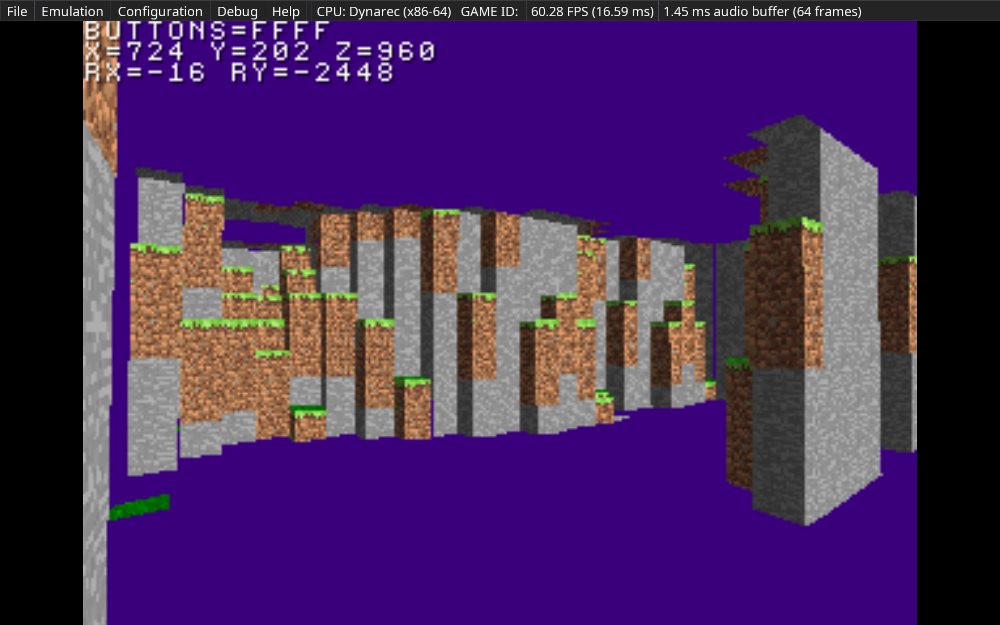

# PSX-Minecraft

Remake of Minecraft for PS1 with PSn00bSDK

## Dependencies

* Emulator: [PCSX Redux](https://github.com/grumpycoders/pcsx-redux)
* PS1 Library: [PSn00bSDK](https://github.com/Lameguy64/PSn00bSDK)

## Building

Configuring the project can be done with

```shell
cmake --preset default .
```

Then the CD image can be built with

```shell
cmake --build ./build
```

This will create several files in the `build` directory. Using the
PCSX Redux emulator, you can load the `build/PSXMC.bin` CD image
and run it.

## Docker Environment

Depending on the system you are building on (Windows/Linux/OSX) you may want to build locally,
however, in the case that you are on OSX and want the ease of a development environment in
Linux without the extra configuration headache, a Dockerfile has been provided that can be
used with the `build_container.sh` script to build the project using given local path to the
PSn00bSDK on your local machine (feel free to modify the Dockerfile and embed the SDK within it).

So for example, if the SDK is at `/Users/Example/Library/psn00bsdk`, first build the docker
image via

```shell
docker build --build-arg="SDK_LOCATION=/Users/Example/Library/psn00bsdk" -t psxmc:latest -f Dockerfile .
```

With this, use the utility script `build_container.sh <SDK location> [<image>]` to bundle assets
and compile the project. For example

```shell
./build_container.sh /Users/Example/Library/psn00bsdk psxmc:latest
```

## Snapshot

Work so far, currently WIP chunk rendering with greedy meshing

